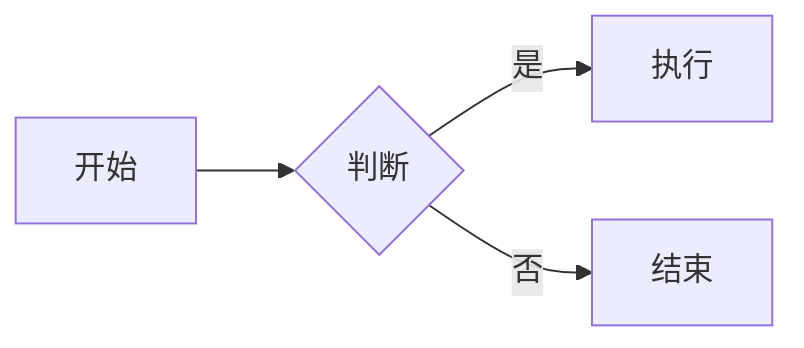

# Slidev 精读笔记

> **来源**：https://sli.dev/guide/ + https://github.com/slidevjs/slidev
> **日期**：2026-01-04
> **类型**：开发者工具 / 演示文稿

---

## 一、项目概述

### 基本信息

| 属性 | 值 |
|------|-----|
| **名称** | Slidev (slide + dev, /slaɪdɪv/) |
| **定位** | 面向开发者的演示文稿工具 |
| **Stars** | 43.4k |
| **Forks** | 1.9k |
| **贡献者** | 318 人 |
| **最新版本** | v52.11.1 (2025-12-20) |
| **许可证** | MIT |

### 核心理念

**"用写代码的方式写 PPT"**

传统 PPT 工具的痛点：
- 格式调整耗时
- 代码展示不友好
- 版本控制困难
- 协作不便

Slidev 的解决方案：
- Markdown 驱动，专注内容
- 原生代码高亮 + 实时编辑
- Git 友好，纯文本文件
- 基于 Vue，可编程扩展

---

## 二、技术架构

### 技术栈组成

```
┌─────────────────────────────────────────────────────┐
│                    Slidev                            │
├─────────────────────────────────────────────────────┤
│  Markdown Parser    →    Vue 3 Components           │
│       ↓                        ↓                    │
│  Frontmatter        →    Layout System              │
│       ↓                        ↓                    │
│  Shiki Highlighter  →    Monaco Editor              │
├─────────────────────────────────────────────────────┤
│                   Vite (构建工具)                    │
├─────────────────────────────────────────────────────┤
│  UnoCSS    KaTeX    Mermaid    Iconify    Drauu    │
│  (样式)    (数学)   (图表)     (图标)     (绘图)    │
└─────────────────────────────────────────────────────┘
```

### 语言占比

| 语言 | 占比 |
|------|------|
| TypeScript | 67.3% |
| Vue | 29.0% |
| JavaScript | 2.1% |
| CSS | 1.6% |

### 核心依赖

| 工具 | 用途 |
|------|------|
| **Vite** | 极速 HMR，开发体验流畅 |
| **Vue 3** | 组件化渲染，支持 Composition API |
| **UnoCSS** | 原子化 CSS，按需生成 |
| **Shiki** | 语法高亮，100+ 语言支持 |
| **Monaco** | VS Code 同款编辑器，实时编码 |
| **KaTeX** | LaTeX 数学公式渲染 |
| **Mermaid** | 文本生成流程图/时序图 |

---

## 三、核心语法

### 3.1 幻灯片分隔

```markdown
# 第一页

这是第一页内容

---

# 第二页

这是第二页内容

---
layout: center
---

# 第三页（居中布局）
```

**关键点**：
- `---` 分隔符（前后需空行）
- 每页可有独立 Frontmatter 配置

### 3.2 Frontmatter 配置

```yaml
---
theme: seriph          # 主题
background: /bg.jpg    # 背景图
class: text-center     # CSS 类
layout: cover          # 布局类型
transition: slide-left # 过渡动画
---
```

常用布局：
- `cover` - 封面
- `center` - 居中
- `two-cols` - 双栏
- `image-right` - 图片在右
- `section` - 章节页

### 3.3 代码高亮

```markdown
```ts {2,3|5|all}
function greet(name: string) {
  // 第一次点击高亮这两行
  console.log(`Hello, ${name}!`)
  
  // 第二次点击高亮这行
  return name.toUpperCase()
}
```
```

**高级特性**：
- `{2,3}` - 高亮指定行
- `{2-5}` - 高亮范围
- `{2|5|all}` - 点击切换高亮
- `{monaco}` - 启用实时编辑器

### 3.4 演讲者备注

```markdown
# 我的幻灯片

这是观众看到的内容

<!-- 
这是演讲者备注
只在演讲者视图显示
-->
```

### 3.5 动画与过渡

```markdown
<v-click>

第一次点击显示

</v-click>

<v-click>

第二次点击显示

</v-click>
```

或使用列表动画：
```markdown
<v-clicks>

- 第一项
- 第二项
- 第三项

</v-clicks>
```

---

## 四、主题系统

### 使用主题

```yaml
---
theme: seriph
---
```

### 官方主题

| 主题 | 风格 |
|------|------|
| `default` | 简洁默认 |
| `seriph` | 优雅衬线 |
| `apple-basic` | 苹果风格 |
| `bricks` | 砖块风格 |
| `shibainu` | 柴犬主题 |

### 自定义主题

```
my-theme/
├── components/      # 自定义组件
├── layouts/         # 自定义布局
├── styles/          # 全局样式
├── setup/           # 初始化脚本
└── package.json
```

---

## 五、导出功能

### 支持格式

| 格式 | 命令 | 用途 |
|------|------|------|
| **PDF** | `slidev export` | 分享/打印 |
| **PPTX** | `slidev export --format pptx` | Office 编辑 |
| **PNG** | `slidev export --format png` | 图片序列 |
| **SPA** | `slidev build` | 静态网站部署 |

### 导出示例

```bash
# 导出 PDF
slidev export

# 导出 PPTX（可编辑）
slidev export --format pptx

# 导出为静态网站
slidev build
# 输出到 dist/ 目录
```

---

## 六、开发工作流

### 快速开始

```bash
# 创建项目
pnpm create slidev

# 启动开发服务器
pnpm dev

# 构建
pnpm build

# 导出 PDF
pnpm export
```

### 项目结构

```
my-slides/
├── slides.md          # 主幻灯片文件
├── components/        # 自定义 Vue 组件
├── layouts/           # 自定义布局
├── public/            # 静态资源
├── styles/            # 全局样式
└── package.json
```

### VS Code 扩展

安装 `Slidev` 扩展获得：
- 语法高亮
- 幻灯片预览
- 代码片段
- 快速导航

---

## 七、高级特性

### 7.1 实时编码演示

```markdown
```ts {monaco-run}
const msg = 'Hello'
console.log(msg)
```
```

观众可以看到代码实时运行结果！

### 7.2 Mermaid 图表

```markdown

```

### 7.3 LaTeX 数学公式

```markdown
行内公式：$E = mc^2$

块级公式：
$$
\int_0^\infty e^{-x^2} dx = \frac{\sqrt{\pi}}{2}
$$
```

### 7.4 绘图标注

按 `D` 键进入绘图模式，可以在幻灯片上实时标注。

### 7.5 录制功能

```bash
# 启动录制模式
slidev --record
```

支持：
- 屏幕录制
- 摄像头画中画
- 导出视频

---

## 八、与传统工具对比

| 特性 | Slidev | PowerPoint | Google Slides |
|------|--------|------------|---------------|
| **代码高亮** | ⭐⭐⭐⭐⭐ | ⭐ | ⭐⭐ |
| **版本控制** | ⭐⭐⭐⭐⭐ | ⭐ | ⭐⭐ |
| **实时编码** | ⭐⭐⭐⭐⭐ | ❌ | ❌ |
| **主题扩展** | ⭐⭐⭐⭐ | ⭐⭐⭐ | ⭐⭐ |
| **学习曲线** | ⭐⭐⭐ | ⭐⭐⭐⭐⭐ | ⭐⭐⭐⭐⭐ |
| **离线使用** | ⭐⭐⭐⭐⭐ | ⭐⭐⭐⭐⭐ | ⭐⭐ |
| **协作编辑** | ⭐⭐⭐ | ⭐⭐⭐ | ⭐⭐⭐⭐⭐ |

---

## 九、适用场景

### 最适合

- 技术分享 / Tech Talk
- 开源项目介绍
- 编程教学
- 内部技术培训
- 开发者大会演讲

### 不太适合

- 商业销售演示（需要复杂动画）
- 非技术人员使用
- 需要大量图片排版的场景

---

## 十、学习路径

```
入门（1小时）
├── 1. 安装并创建第一个项目
├── 2. 学习基本 Markdown 语法
└── 3. 了解布局系统

进阶（半天）
├── 4. 掌握代码高亮技巧
├── 5. 学习动画和过渡
└── 6. 自定义主题和样式

高级（按需）
├── 7. 编写 Vue 组件
├── 8. 集成外部工具
└── 9. 发布自定义主题
```

---

## 十一、实用技巧

### 快捷键

| 快捷键 | 功能 |
|--------|------|
| `Space` / `→` | 下一页 |
| `←` | 上一页 |
| `O` | 幻灯片概览 |
| `D` | 绘图模式 |
| `F` | 全屏 |
| `G` | 跳转到指定页 |

### 演讲者模式

访问 `http://localhost:3030/presenter` 获得：
- 当前幻灯片 + 下一页预览
- 演讲者备注
- 计时器
- 绘图工具

---

## 十二、总结

### 核心价值

1. **开发者友好**：Markdown + Vue，用熟悉的工具做演示
2. **代码优先**：原生代码高亮，Monaco 实时编辑
3. **Git 友好**：纯文本，版本控制无压力
4. **可扩展**：主题/组件/布局全可定制
5. **多格式输出**：PDF/PPTX/SPA 一键导出

### 推荐指数

⭐⭐⭐⭐⭐ **强烈推荐**

对于需要经常做技术分享的开发者，Slidev 是目前最好的选择。

### 快速上手命令

```bash
# 30 秒体验
pnpm create slidev my-talk
cd my-talk
pnpm dev
```

---

## 📝 金句摘录

> "用写代码的方式写 PPT——Markdown 驱动，专注内容。"

> "对于需要经常做技术分享的开发者，Slidev 是目前最好的选择。"

> "代码优先：原生代码高亮，Monaco 实时编辑，让技术演示不再痛苦。"

---

## 个人思考

{留空，供后续补充}

---

## 📚 延伸阅读

- [Slidev 官方文档](https://sli.dev) - 完整使用指南
- [Slidev GitHub](https://github.com/slidevjs/slidev) - 项目源码
- [主题画廊](https://sli.dev/themes/gallery) - 官方主题集合
- [Discord 社区](https://chat.sli.dev) - 社区交流
- [在线演示](https://sli.dev/new) - 快速体验
- [Vite 官方文档](https://vitejs.dev/) - 构建工具
- [UnoCSS 文档](https://unocss.dev/) - 原子化 CSS 引擎
