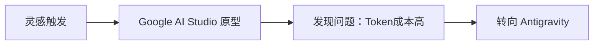
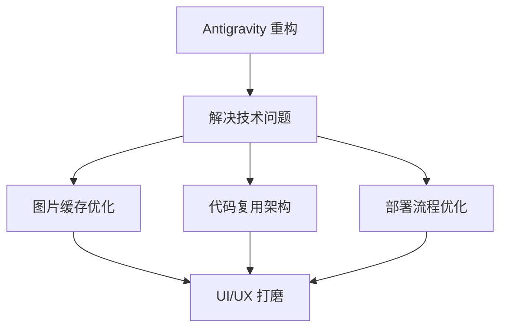
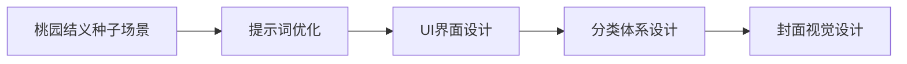
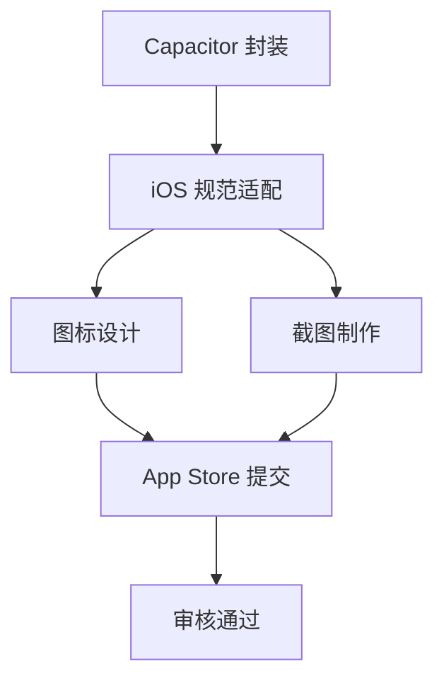
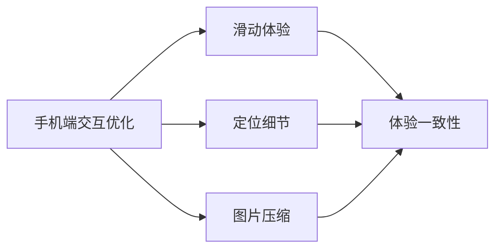
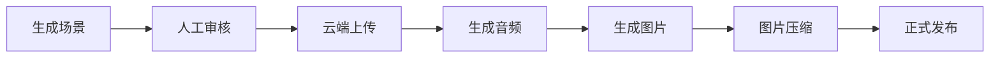

# 「中国故事」App 开发复盘：Antigravity 无代码构建完整应用的实践案例

> 📖 原文：[八千字长文复盘「中国故事」诞生过程](https://note.mowen.cn/detail/gYinb8e_lXKz0l0ALEq_u)  
> 👨‍💻 作者：龙海  
> 📅 学习日期：2026-01-07  
> 🏷️ 分类：AI 工具与效率  
> ⏱️ 开发周期：约 10 天（从构思到上架）

---

## 一句话总结

这是一个用 AI 工具链（Antigravity + Google AI Studio + 多种 AI 服务）在 10 天内完成从创意到 iOS App Store 上架的完整实践案例，展示了 AI 编程如何让非专业程序员也能构建复杂、有品味的应用。

## 🎯 核心价值观察

### 革命性意义
- **编程平权**：编程能力像媒体一样被平权，做个 App 的时间接近写篇文章的时间
- **门槛降低**：从专业程序员的专属技能变成普通用户都能掌握的能力
- **效率提升**：传统移动互联网时代不可能在 10 天内完成的复杂应用开发

### 技术趋势验证
- **AI Agent 化**：从工具辅助到智能体自主完成任务
- **全栈 AI**：涵盖编码、设计、内容生成、部署的完整 AI 工具链
- **快速迭代**：AI 支持的快速原型→测试→优化→发布循环

---

## 🛠️ 技术栈与工具链

### 核心开发工具
| 工具 | 用途 | 关键特性 |
|------|------|----------|
| **Antigravity** | 主要开发平台 | AI Agent 自主编程，任务级可信展示 |
| **Google AI Studio** | 初期原型开发 | 快速验证想法，但 token 成本高 |
| **Capacitor** | 移动端封装 | Web 应用快速转换为原生 App |
| **Vercel/Zeabur** | 部署平台 | 快速部署和托管 |

### AI 服务集成
| 服务 | 功能 | 模型/技术 |
|------|------|-----------||
| **Gemini 3 Pro** | 代码生成 | Google 最新编程模型 |
| **Nano Banana Pro** | 图片生成 | 视觉内容创作 |
| **Listenhub FlowSpeech** | 语音合成 | 文字转语音，支持批量预生成 |
| **云端存储** | 内容管理 | 故事、图片、语音的结构化存储 |

---

## 📋 开发流程复盘

### 第一阶段：概念验证（1-2天）


**关键决策**：
- 受文章启发，复刻网页游戏概念
- 发现 Google AI Studio 的局限性（频繁调用成本高、访问受限）
- 及时转向更适合的 Antigravity 平台

### 第二阶段：核心开发（3-4天）


**技术突破**：
- 图片缓存机制：解决重复生成的性能问题
- 代码复用：模块化架构支持快速扩展
- 部署自动化：简化发布流程

### 第三阶段：内容打磨（2-3天）


**产品化要点**：
- 选择经典场景作为种子内容
- 反复打磨提示词确保内容质量
- 设计清晰的分类和视觉体系

### 第四阶段：移动端适配（1-2天）


**上架关键**：
- 使用 Capacitor 快速将 Web 应用转换为原生 App
- 严格遵循 iOS 设计规范和审核要求
- 准备完整的应用商店素材

### 第五阶段：体验优化（持续）


**用户体验**：
- 针对移动端特点优化交互细节
- 图片体积优化提升加载速度
- 确保跨平台体验一致性

---

## 🚀 创新亮点分析

### 1. Antigravity 的独特优势

#### 任务级可信展示
```
传统 AI 编程工具：你和 AI 一起写代码，AI 给建议
Antigravity：你给任务，AI 自主完成，你负责验证
```

**核心特性**：
- **信任但验证**：AI 先生成详细任务清单和实现计划
- **透明执行**：提供代码变更记录、运行截图、测试结果
- **双模式界面**：编辑器视图（精细调整）+ 管理器视图（任务管理）

#### Agent 权限配置
| 配置项 | 选项 | 影响 |
|--------|------|------|
| **Terminal execution policy** | Off/Auto/Ask | 控制 AI 是否能直接执行命令 |
| **Browser access** | Limited/Full | 控制 AI 的网络访问权限 |
| **File system** | Restricted/Open | 控制 AI 的文件操作范围 |

### 2. 语音功能的巧妙设计

#### 架构演进
```
初版：实时生成语音（用户等待时间长）
↓
优化：首次生成后持久化（减少重复计算）
↓
最终：批量预生成（用户无感知等待）
```

**技术要点**：
- 使用 Listenhub 的 FlowSpeech 服务
- 实现语音缓存和批量预生成机制
- 显著提升用户体验

### 3. 热更新架构设计

#### 架构转换
```
静态架构：故事内容硬编码在应用中
↓
动态架构：内容存储在云端，支持热更新
```

**实现方案**：
- 故事、图片、语音迁移到云端存储
- 建立结构化的数据表设计
- 通过 Antigravity 的 workflow 管理内容生产流水线

#### 内容生产流水线


**半自动化流程**：
- 明确人机分工：AI 生成，人工审核
- 批量处理：支持"大闹天宫"、"真假美猴王"、"后羿射日"等多个故事
- 版本控制：不发版即可更新内容

---

## 💡 最佳实践总结

### 开发策略
| 原则 | 具体做法 | 效果 |
|------|----------|------|
| **勤开新会话** | 避免上下文污染 | 保持 AI 响应质量 |
| **预置与缓存** | 素材提前准备和复用 | 提升开发效率 |
| **明确人机分工** | AI 生成，人工审核 | 确保内容质量 |
| **最快可用路径** | 先上线基础版本 | 快速验证市场反馈 |
| **渐进式架构** | 从简单到复杂迭代 | 降低技术风险 |

### 工具选择决策树
```
项目需求分析
│
├─ 快速原型验证？ ────────→ Google AI Studio
│
├─ 复杂应用开发？ ────────→ Antigravity
│
├─ 移动端需求？ ──────────→ Capacitor 封装
│
├─ 快速部署？ ────────────→ Vercel/Zeabur
│
└─ 内容管理？ ────────────→ 云端存储 + Workflow
```

### 成本效益分析
| 阶段 | 传统开发 | AI 辅助开发 | 效率提升 |
|------|----------|-------------|----------|
| **需求分析** | 1-2 周 | 1-2 天 | 5-7x |
| **原型开发** | 2-4 周 | 1-2 天 | 7-14x |
| **UI/UX 设计** | 1-2 周 | 1 天 | 7-14x |
| **功能开发** | 4-8 周 | 3-4 天 | 7-14x |
| **测试调试** | 1-2 周 | 1 天 | 7-14x |
| **部署上架** | 1 周 | 1-2 天 | 3-7x |
| **总计** | 10-19 周 | 8-12 天 | **5-12x** |

---

## 🎨 产品设计亮点

### 内容策略
- **经典 IP**：选择"桃园结义"等经典中国故事
- **视觉品质**：AI 生成的图片经过精心调优
- **交互体验**：针对移动端优化的滑动和定位
- **扩展性**：结构化的分类体系支持内容扩展

### 技术架构
```
前端：Web 应用（Capacitor 封装）
├─ UI 框架：现代 Web 技术栈
├─ 交互优化：移动端适配
└─ 资源管理：图片压缩和缓存

后端：云端内容管理
├─ 存储：故事、图片、语音分离存储
├─ 工作流：Antigravity workflow 管理
└─ API：内容分发和更新接口

AI 服务：多模态内容生成
├─ 文本：Gemini 3 Pro
├─ 图片：Nano Banana Pro
└─ 语音：Listenhub FlowSpeech
```

---

## 🔮 行业影响与未来趋势

### 编程范式转变
```
传统编程：程序员 → 代码 → 应用
AI 辅助编程：程序员 + AI → 代码 → 应用  
AI 主导编程：产品经理 → AI Agent → 应用
```

### 市场影响预测
| 影响领域 | 短期（1年内） | 中期（2-3年） | 长期（5年+） |
|---------|---------------|---------------|-------------|
| **开发门槛** | 显著降低 | 大幅降低 | 接近零门槛 |
| **开发速度** | 3-5x 提升 | 10x 提升 | 50x+ 提升 |
| **开发成本** | 50% 降低 | 80% 降低 | 90%+ 降低 |
| **创新频率** | 2x 增加 | 5x 增加 | 10x+ 增加 |

### 新兴角色定义
| 传统角色 | 新兴角色 | 核心技能转变 |
|---------|----------|-------------|
| **程序员** | **AI 架构师** | 从写代码到设计系统 |
| **产品经理** | **AI 产品总监** | 从管理人到管理 AI Agent |
| **设计师** | **体验策划师** | 从设计界面到设计交互流程 |
| **测试工程师** | **质量验证师** | 从手动测试到 AI 输出验证 |

---

## 🚀 实践行动指南

### 立即可做（今天）
- [ ] **下载 Antigravity**：访问官网注册并下载客户端
- [ ] **环境配置**：
  ```bash
  # 基础配置
  1. 使用 Gmail 账号登录
  2. 选择从 VS Code/Cursor 导入配置或全新开始
  3. 配置 Agent 权限策略（建议先选择 Ask 模式）
  ```
- [ ] **第一个项目**：尝试让 AI 创建一个简单的 Web 应用
- [ ] **学习资源**：阅读 Antigravity 官方文档和最佳实践

### 短期实践（本周）
- [ ] **复现案例**：尝试构建一个类似的内容展示应用
- [ ] **工具对比**：体验 Antigravity vs Cursor vs 传统 IDE 的差异
- [ ] **移动端实验**：使用 Capacitor 将 Web 应用封装为移动应用
- [ ] **部署实践**：在 Vercel 或 Zeabur 上部署应用

### 中期目标（本月）
- [ ] **完整项目**：从创意到上架完成一个完整的应用开发
- [ ] **AI 工具链**：集成多种 AI 服务（文本、图片、语音）
- [ ] **用户反馈**：收集真实用户的使用反馈并迭代
- [ ] **技术分享**：记录开发过程并分享经验

### 长期规划（持续）
- [ ] **产品矩阵**：基于成功经验开发多个应用
- [ ] **商业化探索**：探索 AI 应用的商业模式
- [ ] **技术深化**：深入学习 AI Agent 开发和管理
- [ ] **社区贡献**：参与 AI 开发工具的生态建设

---

## 🤔 深度思考

### 技术哲学转变
这个案例展示的不仅是工具的进步，更是开发哲学的根本转变：

1. **从"How"到"What"**：开发者不再需要关心如何实现，而是专注于要实现什么
2. **从"编程"到"编排"**：角色从代码编写者变成任务编排者
3. **从"技术驱动"到"创意驱动"**：限制因素从技术能力变成创意和产品思维

### 潜在挑战与风险
| 挑战 | 影响 | 应对策略 |
|------|------|----------|
| **安全风险** | AI 可能执行恶意代码 | 严格的权限控制和代码审查 |
| **质量控制** | AI 生成代码的可靠性 | 完善的测试和验证机制 |
| **依赖风险** | 过度依赖 AI 工具 | 保持基础技术理解 |
| **成本控制** | AI 服务调用成本 | 合理的缓存和优化策略 |

### 未来发展方向
1. **更智能的 Agent**：从任务执行到自主决策
2. **更完善的生态**：标准化的 AI 开发工具链
3. **更低的门槛**：自然语言即可完成复杂开发
4. **更高的质量**：AI 生成代码接近或超越人工质量

---

## 📚 延伸阅读

### 官方资源
- [Antigravity 官网](https://antigravity.dev/) - 官方文档和下载
- [Google AI Studio](https://aistudio.google.com/) - Google 的 AI 开发平台
- [Capacitor 文档](https://capacitorjs.com/) - 跨平台应用开发框架

### 相关工具
- [Cursor](https://cursor.sh/) - AI 辅助编程 IDE
- [Replit](https://replit.com/) - 在线 AI 编程环境
- [GitHub Copilot](https://github.com/features/copilot) - AI 代码助手
- [Vercel](https://vercel.com/) - 前端部署平台

### 学习资源
- [AI 编程最佳实践](https://docs.github.com/en/copilot/using-github-copilot/best-practices-for-using-github-copilot) - GitHub 官方指南
- [无代码开发趋势报告](https://www.gartner.com/en/newsroom/press-releases/2021-02-15-gartner-forecasts-worldwide-low-code-development-technologies-market-to-grow-23-percent-in-2021) - Gartner 分析报告

---

## 个人思考

这个案例最震撼的地方在于**时间压缩**：传统需要几个月的开发周期被压缩到 10 天，而且产出的是一个有品味、有完整功能的应用。这不是简单的效率提升，而是**开发范式的根本性变革**。

**关键启示**：
1. **AI 不是替代程序员，而是重新定义了"编程"这件事**
2. **产品思维变得比技术实现更重要**
3. **快速验证和迭代成为核心竞争力**
4. **创意和用户体验成为主要差异化因素**

未来的"程序员"可能更像是"数字产品的导演"，负责构思、编排和质量把控，而具体的"表演"（编码）交给 AI 来完成。

这个转变对整个软件行业的影响将是深远的，我们正在见证一个新时代的开始。